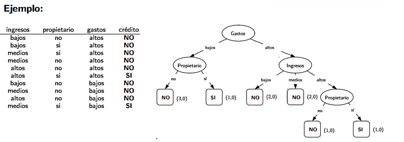
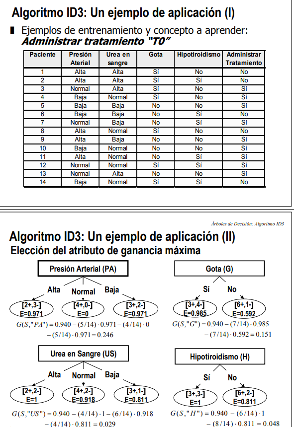
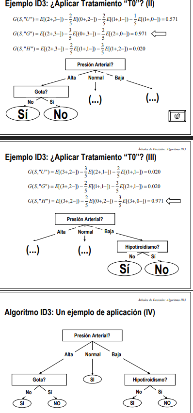

# Arboles de Desicion 

Ayuda a tomar desiciones de forma visual, nos permite sopesar los resultados y consecuencias, trazamos ademas un camino hacia el resultado deseado

Arbol de desicion representa la funcion de hipotesis mediante un grafo dirigido :
    - Cada nodo es una variable de entrada
    - Cada rama es un valor posible de esa variable correspondiente
    - Las hojas corresponden con las variables de clase 
    - clasificamos recorriendo desde la raiz  , eligiendo la rama que satisface la condicion para el valor del atributo, la clase elegida seria la asignada a la hoja a la que llega

<p align="center">
    
</p>

Se construyen particionando el espacio de entrada de manera recursiva. En cada paso se elige la variable que produce la particion optima. La particion se representa en un arbol

Hasta aqui es muy abstracto

## Algoritmo CART
```bash
# se tiene  ALGORITMO CART

i | X1 | X2 | Y
--+----+----+---
1 |  2 |  2 | A
2 |  3 |  1 | A
3 |  4 |  2 | B
4 |  5 |  3 | B
5 |  6 |  1 | B

Paso 1:
    R = {{xi,yi}} i:1→5
    #pero esto se simplifica* indicando la i-esima observacion, de modo que en lugar de R={((2,2),A),((3,1),A),((4,2),B),((5,3),B),((6,1),B)} tenemos 
    R ≡ IR ​= {1,2,3,4,5}  #usamos el indice de la observacion i-esima
    # lo mismo para 
    R1 = {1,2}  == R1​={(x1​,y1​),(x2​,y2​)}
    R2 = {3,4,5} == R2​={(x3​,y3​),(x4​,y4​),(x5​,y5​)}
paso 2 :
    # definimos las proporciones pk​=1/∣R∣ ∑​(yi​=k)
    pA = 2/5   Pb = 3/5
paso 3: 
    # calculando la impureza
    I(R) = 1 - SUMA pk^2
         = 1 - 1/5^2 - 3/5^2 
         = 0.48
paso 4 : 
    # generando candidatos split
    Cj​={ (x(i)j​ + x(i+1)j)/2 ​​}
    # se ordenan los valores de las variables y se calculan los puntos medios de los consecutivos distintos
    C1={2.5,3.5,4.5,5.5}  # para 2, 3, 4, 5, 6
    C2​={1.5,2.5}          # para 1, 1, 2, 2, 3
paso 5
    # definimos las particiones para cada split
    #R1​(j,c)={x∈R:xj​≤c}
    #R2​(j,c)={x∈R:xj​>c}
i | X1 | | Y
--+----+-+---
1 |  2 | | A
2 |  3 | | A
3 |  4 | | B
4 |  5 | | B
5 |  6 | | B
    # para cada split la proporcion y la impureza
        c=2.5
    R1​(1,2.5)={i:xi1​≤2.5}={1}     R1​:pA​=1,pB​=0  I(R1) = 1 -1^2 -0^2 = 0
    R2​(1,2.5)=i:xi1>2.5}={2,3,4,5} R1​:pA​=1/4,pB​=3/4
    I(R2) = 1 - (1/4)^2 - (3/4)^2 = 1 -10/16 = 6/16
    # combinando la impureza Isplit​(j,c)=∣R1∣/∣R​∣​ *I(R1​) + ∣R2∣/∣R​∣*​I(R2​)
    Isplit(1,2.5) = 1/5 * 0 + 4/5*6/16 = 24/80

        c = 3.5
    R1​(1,3.5)={1,2}           R1​:pA​=2/2,pB​=0  I(R1) = 1 -1 - 0 = 0
    R2(1,3.5)={3,4,5}         R1​:pA​=0,pB​=3/3  I(R2) = 1 - 0 - 1 = 0
    Isplit(1,3.5) = 2/5 * 0 + 3/5 * 0 = 0
        c = 4.5
    R1​(1,4.5)={1,2,3}       R1​:pA​=2/3,pB​=1/3  I(R1) = 1 - 4/9 - 1/9= 5/9
    R2(1,4.5)={4,5}         R1​:pA​=0,pB​=2/2    I(R2) = 1 - 0 -1 = 0
    split(1,4.5) = 3/5*5/9 + 2/5*0 = 1/3 
        c =5.5
    R1​(1,5.5)={1,2,3,4}     R1​:pA​=2/4,pB​=2/4   I(R1) = 1 -4/16 -4/16  = 8/16
    R2​(1,5.5)={5}           R1​:pA​=0,pB​=1/1    I(R2) = 1 - 0 - 1 = 0
    split(1,5.5) = 4/5 * 8/16 + 1/5*0 = 32/80
    # observar que es el indice de la observacion y no la variable X1,(A,B)

i | | X2 | Y
--+----+----+---
1 | |  2 | A
2 | |  1 | A
3 | |  2 | B
4 | |  3 | B
5 | |  1 | B
        c = 1.5
    R1​(2,1.5)={2,5}   R1​:pA​=1/2,pB​=1/2   I(R1) = 1 -1/4 - 1/4  = 2/4
    R2​(2,1.5)={1,3,4} R2​:pA​=1/3,pB​=2/3   I(R2) = 1 - 1/9 - 4/9 = 4/9
     Isplit(1,3.5) = 2/5 * 2/4 + 3/5 * 4/9 = 8/20 + 12/45 

        c = 2.5
    R1​(2,2.5)={1,2,3,5} R2​:pA​=2/4,pB​=2/4    I(R1) = 1 -4/16 - 4/16  = 1/2
    R2(2,2.5)={4}       R2​:pA​=0,pB​=1    I(R2) = 1 - 1/9 - 4/9 = 4/9 = 4/9
     Isplit(1,3.5) = 4/5 * 1/2 + 1/5 * 4/9 = 4/10 + 4/45 

paso 6 
    # proporcion en cada particion
    pk∣Rm​​=∣Rm​∣1​i∈Rm​∑​1(yi​=k) # se hizo dentro de paso 5 ,detallando el resto

paso 7
    # impureza de cada region
    I(Rm​)=1−k∑​pk∣Rm​2​  # dentro de paso 5
paso 8
    # combinar impurezas
    ∣R∣∣R1​∣​I(R1​) +|R|∣R2​∣​I(R2​)
    split​(X1​,3.5)   # dentro de paso 5
tenemos
-------------------------------------------------
 Variable |  c    |   R1        |   R2        | Isplit
-------------------------------------------------
   X1     | 2.5   | {1}         | {2,3,4,5}  | 24/80
   X1     | 3.5   | {1,2}       | {3,4,5}    | 0
   X1     | 4.5   | {1,2,3}     | {4,5}      | 1/3
   X1     | 5.5   | {1,2,3,4}   | {5}        | 32/80
-------------------------------------------------

-------------------------------------------------
 Variable |  c    |   R1        |   R2        | Isplit
-------------------------------------------------
   X2     | 1.5   | {2,5}       | {1,3,4}    | 8/20 + 12/45
   X2     | 2.5   | {1,2,3,5}   | {4}        | 4/10 + 4/45
-------------------------------------------------

-------------------------------------------------
 Variable |  c    | Isplit
-------------------------------------------------
   X1     | 2.5   | 0.30
   X1     | 3.5   | 0.00   ← GANADOR
   X1     | 4.5   | 0.333
   X1     | 5.5   | 0.40
   X2     | 1.5   | 0.377
   X2     | 2.5   | 0.444
-------------------------------------------------


paso 9
    #optimizacion local greedy
    (j∗,c∗)=arg j,c min​Isplit​(j,c) = (X1,3.5)
    entonces 
se tiene
                     [ ROOT ]
                  ¿ X1 ≤ 3.5 ?
                   /         \
                  /           \
        R1 = {1,2}             R2 = {3,4,5}
            |                      |
         Y = A                  Y = B
       I(R1)=0               I(R2)=0

paso 10
    # criterio de parada

```

```bash
Antes del criterio de parada , veamos un ejercicio donde hay mas niveles
i | X1 | X2 | Y
--+----+----+---
1 |  1 |  1 | A
2 |  1 |  3 | B
3 |  3 |  1 | B
4 |  3 |  3 | A

R = {1,2,3,4}  #indices
pA = 2/4   pB = 2/4 
I(R) = 1 - (1/2)**2 -(1/2)**2 = 0.5 

split c1 = 2
    c2 = 2

particiones
    R1(x1,2) = {1,2}  pA = 1/2  pB = 1/2   I(R1) = 0.5
    R2(x1,2) = {3,4}  pA = 1/2  pB = 1/2   I(R2) = 0.5
    Isplit=2/4⋅0.5+2/4⋅0.5=0.5

    R1(x2,2) = {1,3}   pA = 1/2  pB = 1/2   I(R1) = 0.5
    R2(x2,2) = {2,4}   pA = 1/2  pB = 1/2   I(R2) = 0.5
    Isplit=2/4⋅0.5+2/4⋅0.5=0.5

   esogiendo x1
                    [ ROOT ]
              ¿ X1 ≤ 2 ?
               /       \
              /         \
         {1,2}           {3,4}
       A,B mezclado     B,A mezclado
          I=0.5            I=0.5
 
 i | X1 | X2 | Y
--+----+----+---
1 |  1 |  1 | A
2 |  1 |  3 | B
pA = 1/2  pB=1/2 
I(R)= 1 -0-5**2 -0.5**2 = 0.5

split
  c=2 , en este caso solo para x2
  R1 = { i : X2 ≤ 2 } = {1} pA=1/1  pB=0    I(R1) = 0
  R2 = { i : X2 > 2 } = {2} pA=0    pB=1/1   I(R2) = 0
  Isplit = 1/2 * 0 + 1/2 *0  = 0

              [ Nodo ]
         pA=0.5 , pB=0.5
             I=0.5
                 |
            ¿ X2 ≤ 2 ?
             /         \
            /           \
        {1}               {2}
        A                 B
      I=0               I=0

finalmente


                             [ ROOT ]
                        ¿ X1 ≤ 2 ?
                         /        \
                        /          \
              R1 = {1,2}            R2 = {3,4}
               I = 0.5                I = 0.5
                  |                      |
            ¿ X2 ≤ c₁ ?            ¿ X2 ≤ c₂ ?
               /    \                  /    \
             {1}    {2}              {3}    {4}
              A      B                B      A
           I=0    I=0              I=0    I=0

```
## Algoritmo ID3 

<p align="center">
    
</p>

```bash
+----+-----------+---------------+-------+-----------------+------------------------+
| ID | Presión   | Urea en Sangre| Gota  | Hipotiroidismo | Administrar Tratamiento|
+----+-----------+---------------+-------+-----------------+------------------------+
|  1 | Alta      | Alta          | Sí    | No              | No                     |
|  2 | Alta      | Alta          | Sí    | Sí              | No                     |
|  3 | Normal    | Alta          | Sí    | No              | Sí                     |
|  4 | Baja      | Normal        | Sí    | No              | Sí                     |
|  5 | Baja      | Baja          | No    | No              | Sí                     |
|  6 | Baja      | Baja          | No    | Sí              | No                     |
|  7 | Normal    | Baja          | No    | Sí              | Sí                     |
|  8 | Alta      | Normal        | Sí    | No              | No                     |
|  9 | Alta      | Baja          | No    | No              | Sí                     |
| 10 | Baja      | Normal        | No    | No              | Sí                     |
| 11 | Alta      | Normal        | No    | Sí              | Sí                     |
| 12 | Normal    | Normal        | Sí    | Sí              | Sí                     |
| 13 | Normal    | Alta          | No    | No              | Sí                     |
| 14 | Baja      | Normal        | Sí    | Sí              | No                     |
+----+-----------+---------------+-------+-----------------+------------------------+

    La clase objetivo es "Administrar Tratamiento = {Si, No}"
    # paso 0
    si = 9     no = 4    total = 14
    E = -9/14 log 9/14 - 5/14 log 5/14 = 0.940
    #todos los split se comparan contra esto
    
    <<----PRESION ARTERIAL PA---- >>

    Alta : 2 si , 3 no   H = -2/5log2/5 - 3/5 log3/5  = 0.971
    Normal : 4 si  , 0 no   H = -4/4 log 4/4 -0 = 0
    Baja : 3 si  , 2 no     H = 0.971

    Entropia promedio acondicionada:
    H(S | PA )  = (2 + 3)/14 * 0.971 + (4 + 0)/14 * 0 + (3 + 2)/14 * 0.971 = 0.694
    Gain(S,PA) = 0.940 - 0.694 = 0.246

    << -----GOTA G------ >>

    si : 3 si , 4 no    H =  -3/7 log 3/4 - 4/7 log 3/4  = 0.985
    no : 6 si , 1 no    H = -6/7 log 6/7 - 1/7 log 1/7 = 0.592

    H(S | G ) = 7/14 * 0.985 + 7/14 * 0.592 = 0.789

    Gain(S,G) = 0.940 - 0.789  = 0.151

    << ----UREA EN SANGRE US---->>
    Alta → (2,2) → 𝐻=1
    Normal → (4,2) → H=0.918
    Baja → (3,1) → H=0.811
    H(S∣US)=4/14*1 + 6/14​*0.918 + 4/14​*0.811 ≈ 0.911
    Gain(S,US) = 0.940 - 0.911 = 0.029

    <<-----HIPOTIROIDISMO H--->>
    Sí → (3,3) → H=1
    No → (6,2) → H=0.811
    H(S∣H)=6/14​ * 1 + 8/14​ * 0.811 = 0.892
    Gain(S,H) = 0.940 - 0.892 = 0.048

    SE eleige PA por tener Gain mas alta, mayor ganancia


```

Ahora 
<p aling="center">
    
</p>

```bash
Alta
+----+---------------+-------+-----------------+------------------------+
| ID | Urea en Sangre| Gota  | Hipotiroidismo | Administrar Tratamiento|
+----+---------------+-------+-----------------+------------------------+
|  1 | Alta          | Sí    | No              | No                     |
|  2 | Alta          | Sí    | Sí              | No                     |
|  8 | Normal        | Sí    | No              | No                     |
|  9 | Baja          | No    | No              | Sí                     |
| 11 | Normal        | No    | Sí              | Sí                     |
+----+---------------+-------+-----------------+------------------------+
si 2   no 3  total = 5
H = -2/5 log 2/5 - 3/5 log 3/5  = 0.971

<< Urea en Sangre US>>
alta :  si 0  no 2     H = -0 log 0 - 2/2 log 2/2 = 0
normal: si 1   no 1    H =  -1/2 log 1/2 - 1/2 log 1/2 = 1
baja:  si 1  no 0      H =  -1/1 log 1/1 - 0/1 log 0/1 = 0
promedio condicionada:
H(PA | US) = 2/5 * 0  + 2/5 * 1 + 1/5 *0 = 0.4
Gain = 0.971 - 0.4 = 0.571

<< Gota G>>
SI: si 0  no 3   H = -0/3 log 0/3 - 3/3log3/3 = 0
NO : si 2  no 0  H = -2/2log2/2 - 0/2 log0/2 = 0

promedio condicionada:
H(PA | G ) = 3/5 *0 + 2/5 *0  = 0
gain(PA,G) = 0.971 - 0 = 0.971  ←← (MAYOR)

<< Hipotiroidismo H>>
SI : si 1  no 1   H = -1/2 log 1/2 - 1/2log1/2 = 1
NO : si 1  no 2   H = -1/3 log1/3  - 2/3 log2/3 = k
promedio condicionada
H(PA | H ) = 2/5 * 1 + 3/5 * k = m
Gain(PA,H) = 0.971 - m = 0.02 


Normal
+----+---------------+-------+-----------------+------------------------+
| ID | Urea en Sangre| Gota  | Hipotiroidismo | Administrar Tratamiento|
+----+---------------+-------+-----------------+------------------------+
|  3 | Alta          | Sí    | No              | Sí                     |
|  7 | Baja          | No    | Sí              | Sí                     |
| 12 | Normal        | Sí    | Sí              | Sí                     |
| 13 | Alta          | No    | No              | Sí                     |
+----+---------------+-------+-----------------+------------------------+
si 4  no 0   H = -4/4 log 4/4 - 0/4 log 0/4 = 0

<< US >>
alta : si 2  no 0   H = 0
baja : si 1  no 0   H = 0 
normal: si 1  no 0   H = 0
promedio condicionada
H(PN | US)  = 2/4 * 0 + 1/4 *0 + 1/4 *0 = 0
gain = 0 - 0 = 0

<<G>>
SI : H = 0
NO : H = 0
promedio condicionada
H(PN|G) = 0
gain = 0

<<H>>
SI:  H=0
No:  H=0
H(PN|H) = 0
gain = 0
---HOJA----


Baja
+----+---------------+-------+-----------------+------------------------+
| ID | Urea en Sangre| Gota  | Hipotiroidismo | Administrar Tratamiento|
+----+---------------+-------+-----------------+------------------------+
|  4 | Normal        | Sí    | No              | Sí                     |
|  5 | Baja          | No    | No              | Sí                     |
|  6 | Baja          | No    | Sí              | No                     |
| 10 | Normal        | No    | No              | Sí                     |
| 14 | Normal        | Sí    | Sí              | No                     |
+----+---------------+-------+-----------------+------------------------+
si  3   no 2  total =5
H = -3/5 log3/5 - 2/5 log 2/5 = 
<<US>>
Bajo: si 1 no 1   H = -1/2log1/2 -1/2 log1/2 = 1
normal:si 2  no1  H = -2/3 log 2/3 - 1/3 log1/3 = 
alta : si 0 no 0  H =0
promedio condicionada
H(PB | US) = 2/5 * 1 + 3/5*m + 0 = 

<<G>>
SI: si 1 no 1   H = ...
NO: si 2  no 1  H =..
H(PB | G ) = ..
gain = ...

<< H>>
SI: si 0 no 2 H=..
NO: si 3 no 0 H= ..
P(PB | H) =..
gain = alto   ESCOGER

```
finalmente 
```bash
                    Presión Arterial
                   /        |        \
               Alta        Normal     Baja
                |            |          |
             Gota?           Sí   Hipotiroidismo?
            /     \                 /        \
         No       Sí              No          Sí
         Sí       No              Sí          No

```

## Algoritmo C4.5

```bash
Estado   Humedad  Viento  Jugar
--------------------------------
Soleado  Alta     Leve    No
Soleado  Alta     Fuerte  No
Nublado  Alta     Leve    Sí
Lluvia   Alta     Leve    Sí
Lluvia   Normal   Leve    Sí
Lluvia   Normal   Fuerte  No
Nublado  Normal   Fuerte  Sí
Soleado  Alta     Leve    No
Soleado  Normal   Leve    Sí
Lluvia   Normal   Leve    Sí
Soleado  Normal   Fuerte  Sí
Nublado  Alta     Fuerte  Sí
Nublado  Normal   Leve    Sí
Lluvia   Alta     Fuerte  Sí

la variable objetivo es Jugar = {Sí, No}

```
