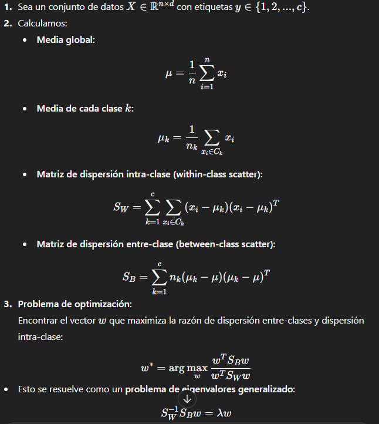
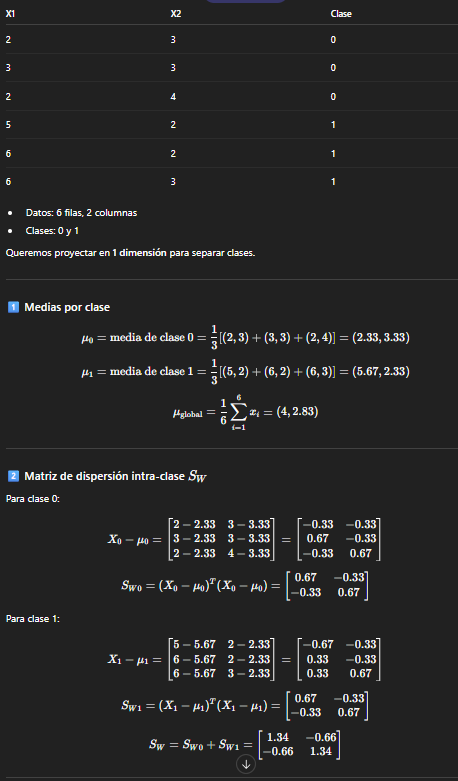
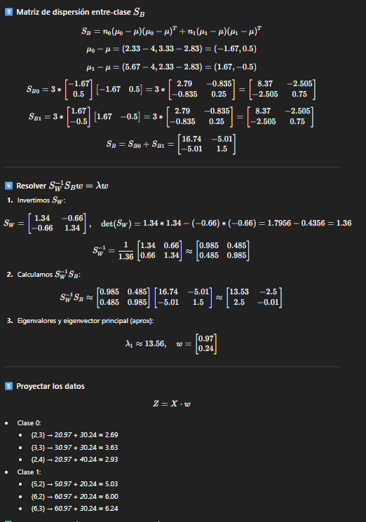
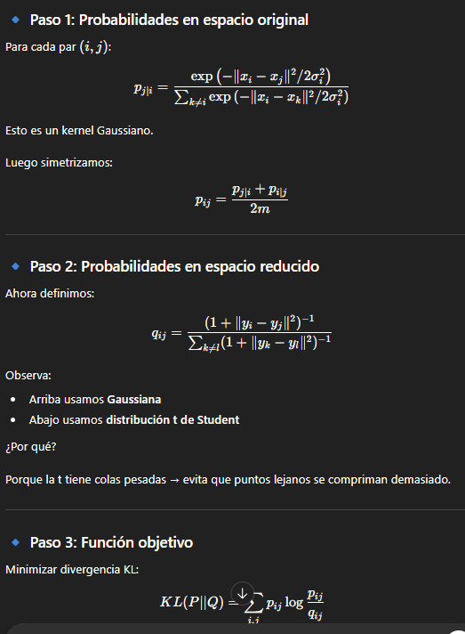
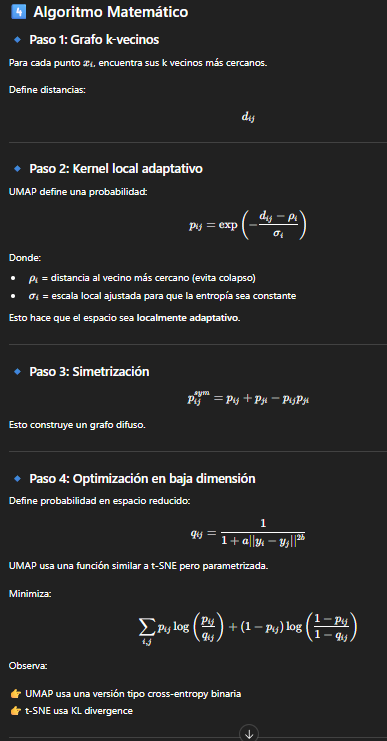
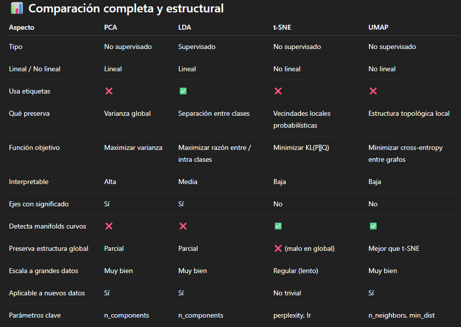

## LDA
Merodo de reduccion de dimension supervisado, maximiza la separacion entre clases de datos.

Maximiza la varianza entre-clases, minimiza la varianza dentro de la clase

<p align="center">

</p>

Ejemplo

```bash
==========================
       EJEMPLO MANUAL LDA
==========================

Datos originales:
X1  X2  Clase
2   3    0
3   3    0
2   4    0
5   2    1
6   2    1
6   3    1

1️⃣ Medias por clase y global:
Clase 0: μ0 = ((2+3+2)/3 , (3+3+4)/3) = (2.33, 3.33)
Clase 1: μ1 = ((5+6+6)/3 , (2+2+3)/3) = (5.67, 2.33)
Media global: μ = ( (2+3+2+5+6+6)/6 , (3+3+4+2+2+3)/6 ) = (4, 2.83)

2️⃣ Matriz de dispersión intra-clase SW:
X0 - μ0 = 
[-0.33, -0.33]
[ 0.67, -0.33]
[-0.33,  0.67]

SW0 = (X0-μ0)^T*(X0-μ0) = |0.67  -0.33|
                             |-0.33  0.67|

X1 - μ1 = 
[-0.67, -0.33]
[ 0.33, -0.33]
[ 0.33,  0.67]

SW1 = (X1-μ1)^T*(X1-μ1) = |0.67  -0.33|
                             |-0.33 0.67|

SW = SW0 + SW1 = |1.34  -0.66|
                  |-0.66 1.34|

3️⃣ Matriz de dispersión entre-clase SB:
μ0 - μ = (-1.67, 0.5)
μ1 - μ = ( 1.67,-0.5)

SB0 = n0*(μ0-μ)*(μ0-μ)^T = 3*|2.79  -0.835|
                               |-0.835 0.25|
     = |8.37 -2.505|
       |-2.505 0.75|

SB1 = n1*(μ1-μ)*(μ1-μ)^T = 3*|2.79  -0.835|
                               |-0.835 0.25|
     = |8.37 -2.505|
       |-2.505 0.75|

SB = SB0 + SB1 = |16.74 -5.01|
                  |-5.01 1.5 |

4️⃣ Resolver eigenvalores: SW^-1 * SB * w = λ*w
SW^-1 ≈ (1/det(SW)) * | 1.34  0.66 |
                       | 0.66  1.34 |
det(SW) = 1.34*1.34 - (-0.66)*(-0.66) = 1.36
SW^-1 ≈ |0.985 0.485|
         |0.485 0.985|

SW^-1 * SB ≈ |13.53 -2.5 |
              | 2.5  -0.01|

Eigenvector principal (λ máximo) ≈ w = [0.97, 0.24]

5️⃣ Proyección de los datos: Z = X * w

Clase 0:
(2,3) → 2*0.97 + 3*0.24 ≈ 2.69
(3,3) → 3*0.97 + 3*0.24 ≈ 3.63
(2,4) → 2*0.97 + 4*0.24 ≈ 2.93

Clase 1:
(5,2) → 5*0.97 + 2*0.24 ≈ 5.03
(6,2) → 6*0.97 + 2*0.24 ≈ 6.00
(6,3) → 6*0.97 + 3*0.24 ≈ 6.24

✅ Las clases ahora están separadas en 1 dimensión. 
```

<p align="center">
    
</p>

<p align="center">
    
</p>


## t -sne

Reduccion de dimensionalidad no lineal

Intenta preserver vecindad probabilistica

Si dos puntos estan cerca en alta dimension , en baja dimenson tambien los estaran

Tenemos x1​,x2​,...,xm​∈Rd y vamos a representarlos como y1​,y2​,...,ym​∈R2

PASOS

<p align="center">
    
</p>

```bash
X₁ = (0, 0)
X₂ = (1, 0)
X₃ = (5, 0)

paso 1 : Similitudes en el espacio original
d12​=1   ||X₁ - X₂||² = 1 
d13​=5   ||X₁ - X₃||² = 25
d23​=4   ||X₂ - X₃||² = 16

      0    1    25
D^2=  1    0    16
      25  16    0


usando la formula para los puntos que forman pares con i
para X1 : 

12: exp(−1/2)=e−0.5≈0.607
13: exp(−25/2)=e−12.5≈3.7×10−6

z1 = (0.607  + 3.7×10−6) 

p2|1 = 0.607/ z1 =  0.999994
p3|1 = 3.7×10−6/ z1 = 0.000006

para X2 :
12: exp(−1/2)=0.607
23: exp(−16/2)=e−8=0.000335

Z2​=0.607+0.000335=0.607335

p1∣2​=0.607 /(0.607335) =0.99945
p3∣2​=0.000335/ (0.607335) = 0.00055


para X3: 
23: exp(−16/2)=0.000335
13: exp(−25/2)=0.0000037
z3 = 0.000335 + 0.000335 = 0.0003387
p2∣3​=0.989
p1∣3​=0.011

p2∣3​=0.989
p1∣3​=0.011


Paso 3:

luego simetrizando 
pᵢⱼ = (p(j|i) + p(i|j)) / 2N
n = 3
(1,2) 
    p12 = (p2|1 + p1∣2) /6  =0.999994 + 0.99945  /6 = 0.33324

(1,3)
   p13 = (p3|1 + p1|3 )/6
       =0.000006 + 0.011 /6
       =0.00183

(2,3)
    p23​=0.00055+0.989 / 6​ = 0.16493

p12​>p23​>>p13​


paso 4: 

iniciando los ys 

y1​=−0.5,y2​=0,y3​=0.5   (aleatorio, pequeño)

paso 5 :  
calculando la similitud en baja dimension

∣y1​−y2​∣=0.5
∣y2​−y3​∣=0.5
∣y1​−y3​∣=1

(1+d^2)^−1
0.5 : (1+0.25)−1=1/1.25=0.8
1 :   (1+1)^−1=1/2=0.5

entonces los pesos son w12​=0.8   w23​=0.8   w23​=0.8

en el denominado k!=l 
(1,2)
(2,1)
(1,3)
(3,1)
(2,3)
(3,2)

w21​=w12​=0.8   w32=w23 = 0.8  w31=w13=0.5 

Z  = 0.8+0.8+0.8+0.8+0.5+0.5 = 4.2
ahora las probabilidades: 

q12  = 0.8 / 4.2 = 0.1905
q23 =  0.8 /  4.2 = 0.1905
q13 = 0.5 / 4.2 = 0.1190

comprobando 2(0.1905 + 0.1905 + 0.1190) = 1

paso 6 : 

| Par | P      | Q     |
| --- | ------ | ----- |
| 1–2 | 0.333  | 0.19  |
| 2–3 | 0.165  | 0.19  |
| 1–3 | 0.0018 | 0.119 |

1–2 debería estar más cerca → Q es demasiado pequeño.

1–3 debería estar casi 0 → Q es demasiado grande.


paso 7:  GRADIENTe, minimizando KL divergence
actualizar posiciones (es un descenso de gradiente )
delata C / delta yi = 4∑​(pij​−qij​) (yi​−yj​)​ /1+(yi​−yj​)^2
                       j

y1: 
con 2 : 
    (0.333−0.19)(−0.5)/(1.25)=0.143(−0.4)=−0.057

con 3: 
    (0.0018−0.119)(−1)/(2)=−0.117(−0.5)=0.058

−0.057+0.0586=0.0016
∂C/∂y1=4(0.0016)=0.0064

    actualizar
    y1* = -0.5 - LR(100)* 0.0064 =   -1.14

    lo mismo para y2 , y3 

paso8: 
    recalular 
    ∣y1​−y2​∣=∣−1.14−0∣=1.14
    |y1​−y3​∣=∣−1.14−0.5∣=1.64
    ∣y2​−y3​∣=0.5

nuevos wij =(1+d^2)^−1
1.14^2=1.2996
1.14^2=1.2996
0.5^2=0.25

w12​=1/1+1.2996​=1/2.2996​≈0.435
w13​=1/1+2.6896​=1/3.6896​≈0.271
w23​=1/1+0.25​=0.8

=2(0.435+0.271+0.8)
Z=2(1.506) = 3.012

q12​=0.435/3.012≈0.144
q13​=0.271/3.012≈0.090
q23​=0.8/3.012≈0.266

​∂C​/∂y1 = nuevo
dC/dy1 = 4 * sum_j (p1j - q1j) * (y1 - yj) / (1 + (y1 - yj)^2)

Con j = 2:

p12 - q12 = 0.333 - 0.144 = 0.189
y1 - y2 = -1.14
den = 1 + 1.2996 = 2.2996

term12 = 0.189 * (-1.14) / 2.2996 ≈ -0.094

Con j = 3:

p13 - q13 = 0.0018 - 0.090 = -0.0882
y1 - y3 = -1.64
den = 1 + 2.6896 = 3.6896

term13 = (-0.0882) * (-1.64) / 3.6896 ≈ 0.039

Suma:

-0.094 + 0.039 = -0.055

Multiplicamos por 4:

dC/dy1 = 4 * (-0.055) = -0.22

PASO 6 — Actualizacion

Si learning_rate = 100:

y1_new = y1 - LR * grad
y1_new = -1.14 - 100 * (-0.22)
y1_new = -1.14 + 22
y1_new = 20.86


```

## UMAP

REduce la demensionalidad , usando busqueda aproximada de vecinos basada en grafos

Es un metodo no lineal basado en :
- geometria de variedades
- teoria de grafos
- topologia algebraica

Preserva estructura topologica local

<p align="center">
    
</p>


### comparacion 

```bash
| Aspecto                    | PCA                | LDA                                  | t-SNE                              | UMAP                                 |
| -------------------------- | ------------------ | ------------------------------------ | ---------------------------------- | ------------------------------------ |
| Tipo                       | No supervisado     | Supervisado                          | No supervisado                     | No supervisado                       |
| Lineal / No lineal         | Lineal             | Lineal                               | No lineal                          | No lineal                            |
| Usa etiquetas              | ❌                  | ✅                                    | ❌                                  | ❌                                    |
| Qué preserva               | Varianza global    | Separación entre clases              | Vecindades locales probabilísticas | Estructura topológica local          |
| Función objetivo           | Maximizar varianza | Maximizar razón entre / intra clases | Minimizar KL(P‖Q)                  | Minimizar cross-entropy entre grafos |
| Interpretable              | Alta               | Media                                | Baja                               | Baja                                 |
| Ejes con significado       | Sí                 | Sí                                   | No                                 | No                                   |
| Detecta manifolds curvos   | ❌                  | ❌                                    | ✅                                  | ✅                                    |
| Preserva estructura global | Parcial            | Parcial                              | ❌ (malo en global)                 | Mejor que t-SNE                      |
| Escala a grandes datos     | Muy bien           | Muy bien                             | Regular (lento)                    | Muy bien                             |
| Aplicable a nuevos datos   | Sí                 | Sí                                   | No trivial                         | Sí                                   |
| Parámetros clave           | n_components       | n_components                         | perplexity, lr                     | n_neighbors, min_dist                |

```

<p align="center">
    
</p>