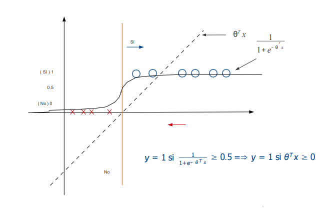
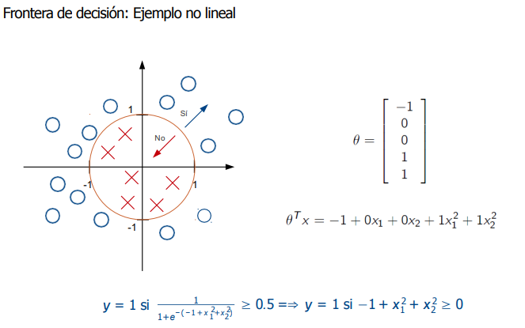
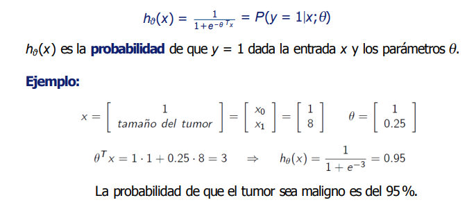
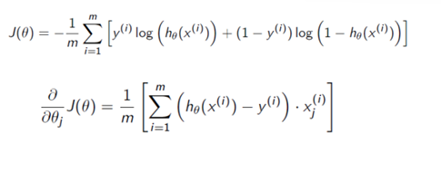
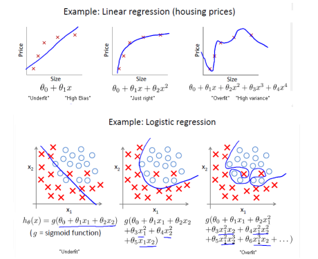
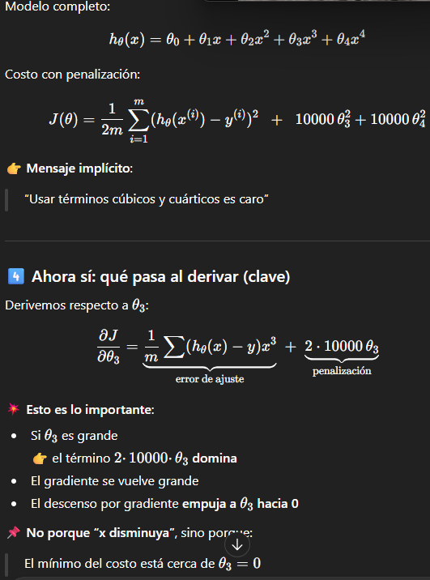
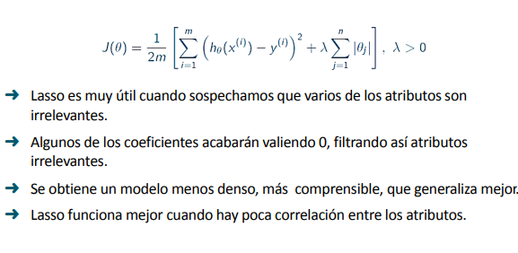
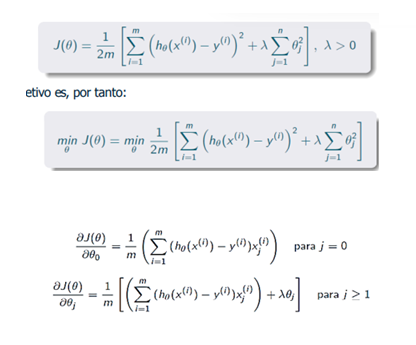
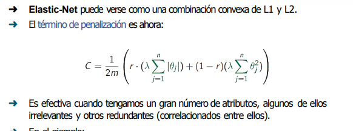

# REGRESION LOGISTICA
Queremos clasificar la clase a la que pertenece una entrada dada, es un tipo de aprendizaje supervisado , aprende de un conjunto ya clasificado.

y e {0,1} se busca que 0 h(x)<1, de forma intutiva se tiene la **regresion lineal x@theta** luego esta se evalua mediante la funcion sigmoide **h** de modo que si el valor es >=umbral → y = 1 0 y =0 respectivamente.

    

La frontera de desicion sería el theta obtenido (mediante la ecuacion normal ?) luego , se tendria

    

Un ejemplo clarificador 

    

No se usa el error cuadratico, pue con h = sigmoide  , J(theta)  = SUMA (h(xi)  - yi)**2 no es convexa. 

Entonces el coste sera -log(h_x(x)) y =1   -log(1-h_x(x))  y=0

coste h_x(),y = -ylog(h_x(x)) - (1 - y)log(1-h_x(x)), luego derivando y usando la gradiente descendente 

    

## Regularizacion
Para el tratamiento del sobreajuste, overfifting, esto es que el modelo no generalice con nuevos datos. Una de las causas es el uso de demasiadas caracteristicas(predictores?) 

    

1. Reduccion del numero de caracteristicas: seleccionar manualmente de las caracteristicas, algoritmos

2. Regularizacion: reducir la magnitud de los valores de theta 

Se introduce esto de modo que penalizando theta3 o theta4(ejemplo) estos parametros tenderan a valores pequeños. 

    

- L1 

    

- L2

    

- Elastic-Net

    

Accuracy , metrica de evaluacion mas basica **Accuracy = (TP + TN)/all samples**

