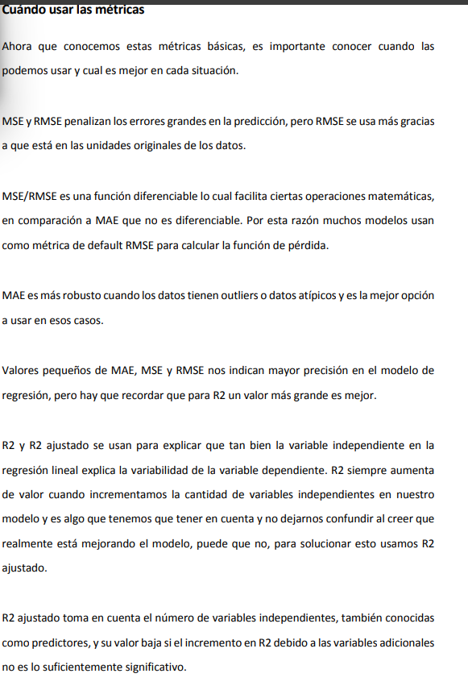
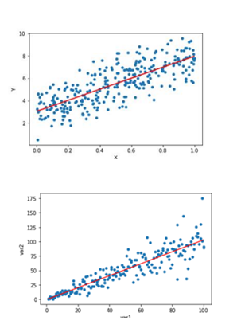
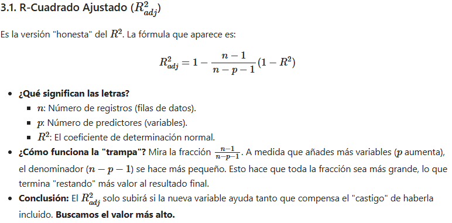
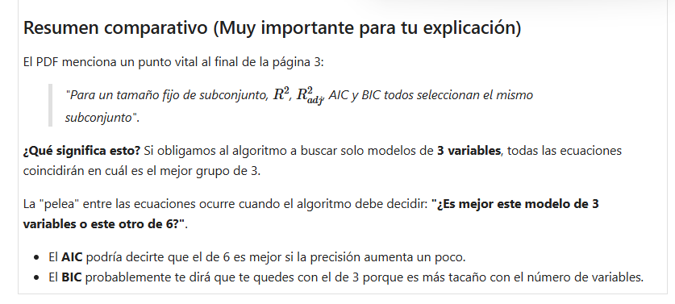

## Metricas 
- Error absoluto medio **MAE = SUMA |y_r - y_p|/n**

- Error medio cuadratico **MSE = SUMA (y_r - y_p)^2 /n** y su relacionado RMSE

- **R2 = 1  -  SUMA (y_ - y_p)^2 / SUMA (yi - media_y)^2**

- **R2 ajustado = 1 - (1 - R2)(N - 1)/(N-M-1)**   N=filas M=columnas
Este crece o se mantiene igual pero nunca disminuye.

    

## homo - hetero Cedasticidad
La cedasticidad se refiere a que la varianza de los errores es la misma en diferentes muestras

    

## Multicolinealidad
Las variables independientes estan correlacionadas 
Si esta correlacion es alta no se podra aislar la relacion entre cada variable independiente y la dependiente

Si no se puede aislar los efectos (de cada independiente sobre la dependiente) puede confundirse los efectos..

Osea los coeficientes de theta (luego de la regresion) ya no miden el efecto de la variable independiente sin varias las otras sino ??(GEMINI) los coeficientes se vuelven inestables, dado que un coeficiente theta i representa cuantos cambia y debido por cada unidad que aumenta xi asumiendo que las otras permanecen constantes.

- Multicolinealidad de los  datos (de los datos)
    queremos predecir la esperanza de vida de lo europeos en funcion de POBLACION y PIB , pero sucede que poblacion y pib estan correlacionados....

- Multicolinealidad estructural (de algo incluido en el modelo)
Mejoria de los pacientes en funcion de las dosis y la edad, generalmente la respuesta (favorable o no) depende de la edad , de modo que , entonces se incluye un termino dosis-edad

- Consecuencias: los thetai cambian, se dificulta la interpretacion

se reduce la precision de las estimaciones, aumenta el error estandar

la significancia estadistica (p-valor) de los coeficientes se vuelven menos confiables

- Si solo se tiene una multicolinealidad moderada no se necesita resolverla  ; si no se usan las predictoras(variables ) correlacionadas , no resolverla

- solo afectan los coeficientes y los p-values , si solo se necesita predecir y no se necesita entender el papel de cada variable.
Se detecta con el **factor de deteccion de la varianza** VIF = 1  no hay correlacion , VIF<5 correlacion moderada, VIF > 5 niveles criticos

Corrigiendo la colinealidad (estructural)centrando los datos 

**Que sucede si los centramos?**
- la interpretacion de los coeficientes de regresion siguen siendo los mismos
- los VIF del modelo no mostraran estos problemas
- La precision de las estimaciones aumenta
- Puede que varien los signos de los coeficientes de regresion y la simplificacion estadistica p-value

**Que no cambia**
la bondad del ajuste

el RSE no cambia

Corrigiendo la colinealidad de datos
- eliminar algunas variables
- combinar linealmente , usar PCA 
- Usar lasso 

## Seleccion de variable en Regresion lineal 

El poder computacional actual permite procesar muchisimas variables, pero el enfoque **kitchen-sink** todo a la vez es peligroso.

- Costo y factibilidad(caro) 
- calidad de los datos (a mas variables mas riesgo de valores faltantes)
- parsimonia (modelos simples mas faciles de entender) 
- multicolinealidad (demasiadas variables pueden estar correlacionadas)
- trade-off Sesgo-varianza **Bias-varianza** si aumentas variables aumenta la varianza(el modelo se vuelve sentible a cambios en el entrenamiento), si quitamos variables aumenta el sesgo (el modelo es muy simple ,no captura la realidad)

### Como reducir el numero de predictores

conocimiento de negocio : 

**Eliminacion manual** descartar variables costosas de medir, correlacionadas entre si, con errores, o simplemente no tengan sentido para el problema. 

**Herramientas estadisticas iniciales** usar tablas de correlacion y graficas para identificar que variables no aportan informacion nueva

### Busqueda exhaustiva

Evaluar todas las posibles combinaciones de predictores

Probamos todas las combinaciones de todos los tamaños posibles

Evaluando el R2 , penalizamos la complejidad:
1. r2 ajustado : penalizar el modelo por cada predictor extra, r2ajustado alto = mse menor
2. AIC : estima el error de prediccion ,penaliza el numero de parametros

3. BIC: la penalizacion por cada variable extra es mas fuerte, se buca el valor mas bajo

R2 siempre sube cuando se añade una nueva variable(predictor) , si se añade xi(color de calcetin) para predecir el precio de un auto

Los tres jueces R2_ajustado, AIC(2k), BIC (klogn)  

**R2_asjutastado** : n - p -1 disminuye al aumentar p (una variable) entonces para que el termino que esta siga siendo pequeño , (y_real -y_p )^2 tiene que dismuir para que este segundo termino siga siendo pequeño, de modo que R2_ajustado sea grande , que es lo que se busca

    

**AIC**  buscamos el modelo que menos informacion pierda , SSE bajo su logaritmo tambien, esto es lo usual, el termino 2(p + 1) castigamos el añadir una nueva variable

Se busca AIC bajo

**BIC** castigamos n (m en los codigos, la cantidad de filas) se busca modelos simples , osea si la informacion ganada realmente compensa la complejidad

### Mlxtend

- Seleccion de variable

**EFS** prueba todas las combinaciones

**SFS** forward selection y backward elimination

- Visualizacion de modelos

Dibujano regiones de desicion, mapas de calor para mostrar como un modelo esta clasificando los datos en un plano 2D , para ver sobresajuste

- Reglas de asociacion, data mining , apriori ,association rules. 

