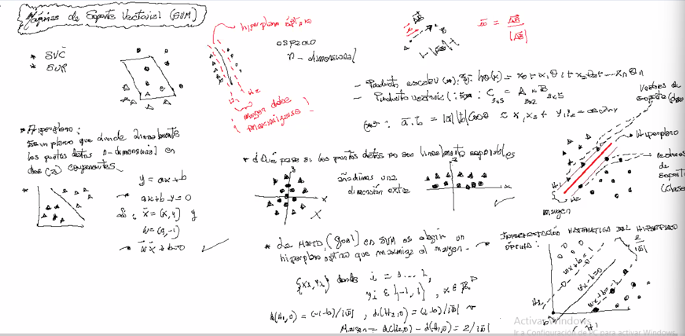
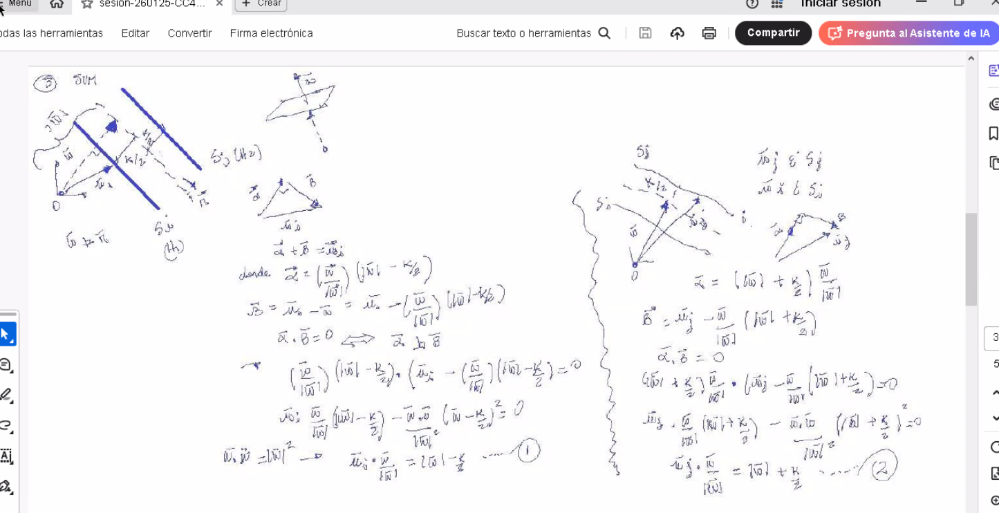
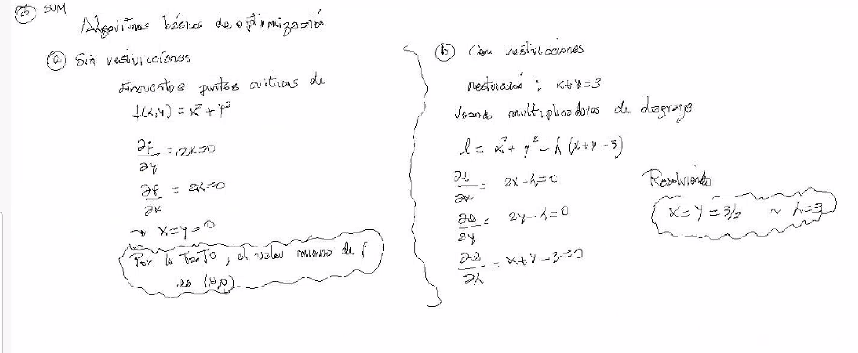
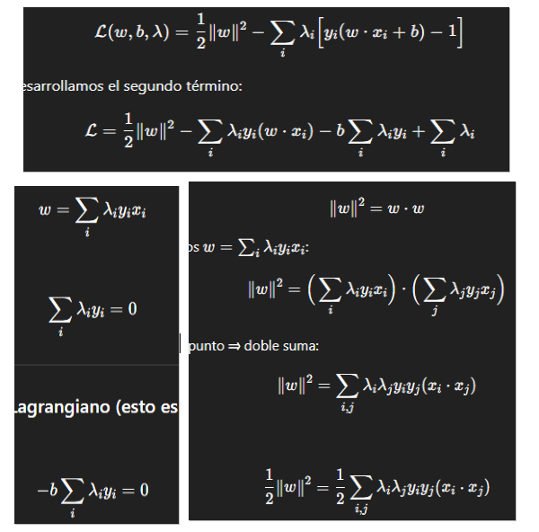
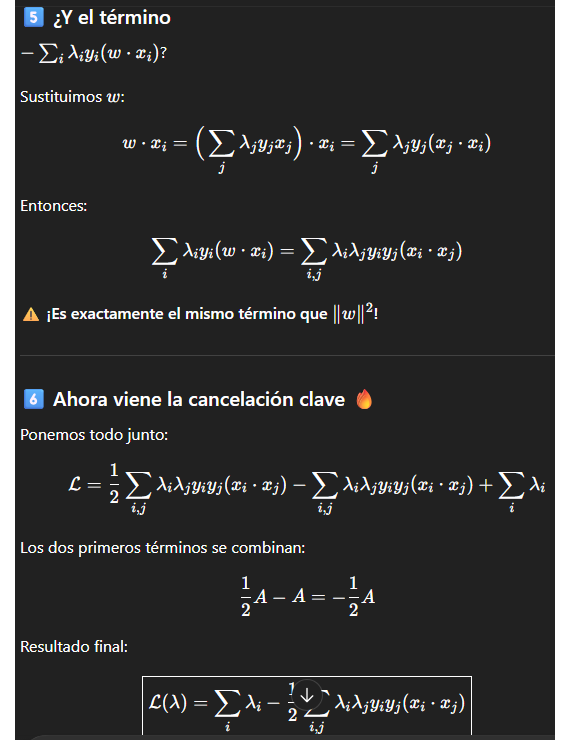
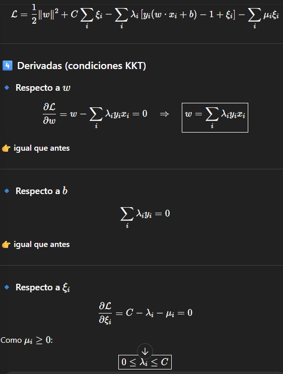
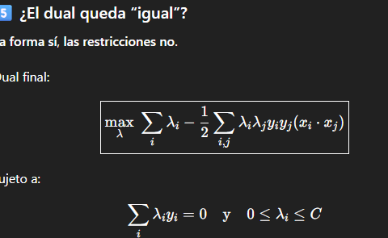
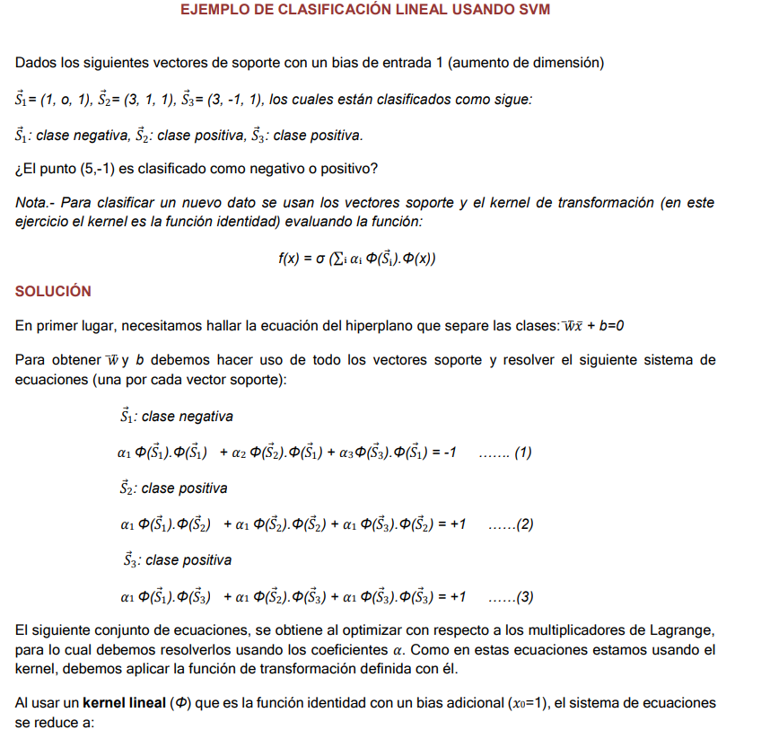
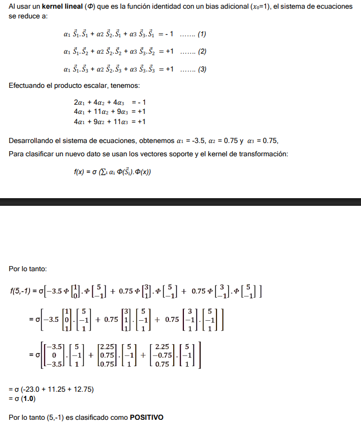

# SVM 
Resumen de gpt, lo genial es que sintetiza la teoria
Que se esta haciendo ? <br>
1. Buscamos el hiperplano **w*X + b = 0** que maximiza el margen **1/||w||** , lo cual es minimizar **||w||** , pero matematicamente no se maximiza el margen directamente, sino que haremos algo equivalente

2. La distancia de un punto **x** al hiperplano **d(x,H) = |wx + b|/||w||** la margen entre las rectas es **marge =2 /||w||** .

3. Para datos etiquetados **(xi,yi)** con **yi** pertenece **{-1,1}** Problema Primal : <br>
min **||w||^2 / 2** sujeto a   **yi(wx*i + b) >=1** , promagramacion cuadratica convexa

4. Relajacion SOFT MARGIN, con una variable de holgura **yi(w xi + b)>= 1 -Ei**  Ei >=0 Funcion objetivo **min |w|^2 / 2  + C SUMA Ei** 

5. Primal , langrangiano
**L(w , b, lam) = |w|^2 / 2 - SUMA li(yi(wixi + b)-1)** con **li>=0**
<p align="center">
    
</p>


<p align="center">
    
</p>

<p align="center">
    
</p>


<p align="center">
    
</p>

<p align="center">
    
</p>

Derivando el lagrangiano se obtiene (como lo indica la figura) 
**delta L/ delta w** = **w -SUMA liyixi** =  0   →  **w = SUMA li yi xi** <br>
**delta L /delta l** = **SUMA yi (wi xi)  -1** = 0   <br>
**delta L / delta b** = **SUMA li yi** = 0 

Para el primal se reemplaza estos en el L (langrangiano) que se tenia<br>
**L(w,b,l) = |w|^2 /2 - SUMA li(yi(w xi + b) - 1)**<br>

**L = |w|^2 /2 -SUMA liyi(w . xi) -b SUMA liyi + SUMA li**<br>

Se entiende mejor en forma grafica....

<p align="center">
    
</p>
Finalmente
<p align="center">
    
</p>
 
Ahora si se admiten errores, caso linealmente no separable.

min **|w|^2 /2 + C SUMA Ei** <br> 
sujeto a **yi(w.xi + b) >= 1 - Ei**<br>
con **Ei>=0**<br>
Entones el lagrangiano completo es<br>
L = **|w|^2 /s + C SUMA Ei - SUMA li(yi(w.xi + b) -1 + Ei) - SUMA uiEi**<br>
**delta L/delta w = w - SUMA liyixi = 0** w=**SUMA liyixi**<br>
delta L/delta b = **SUMA liyi = 0**<br>

delta L/delta Ei = **C - li -ui = 0** con **0 <= li <= C**<br>

<p align="center">
    
</p>

Sin duda gpt es un gran amigo

<p align="center">
    
</p>

Entonces la se optimiza lo mismo que en el caso hard , pero con otras restricciones. En este punto cabe aclarar el C como termino de "penalizacion" de los errores. Si C → inf el modelo castiga los errores, evita violaciones, pero si son datos separales Ei = 0.<br>
como se quiere minimizar y C es grande lo unico que queda es que Ei=0<br>


## El ejercicio de la clase
<p align="center">
    
</p>

<p align="center">
    
</p>

Como este ejercicio parece una tanto distinto a la codificacion hecha, gemini ayudó a aclarar algunos conceptos. 
```bash
la frontera de desicion es :
f(x) = w . phi(x) + b
pero en el ejercicio  b esta metido dentro de phi , por eso los vectores tienen un 1 al final.  , quedando la formula simplemente como 
f(x) = w . phi(x)
w = a1.phi(S1) + a2.phi(S2) + a3.phi(S3)
# acerca de los signos de yj, ya estan absorbidos en el valor final de los alpha

luego si queremos que S1 este en el margen
f(S1) = w . phi(S1) = -1
      = [a1.phi(S1) + a2.phi(S2) + a3.phi(S3) ].phi(S1) = -1
    = a1 phi(S1).phi(S1) + a2 phi(S2).phi(S1) + a3 phi(S3).phi(S1)=-1
```
Luego lo mismo para S2 y S3
```bash
𝛼1 Φ(𝑆⃗1).Φ(𝑆⃗2) + 𝛼1 Φ(𝑆⃗2).Φ(𝑆⃗2) + 𝛼1 Φ(𝑆⃗3).Φ(𝑆⃗2) = +1

𝛼1 Φ(𝑆⃗
1).Φ(𝑆⃗
3) + 𝛼1 Φ(𝑆⃗
2).Φ(𝑆⃗
3) + 𝛼1 Φ(𝑆⃗
3).Φ(𝑆⃗
3) = +1 
```